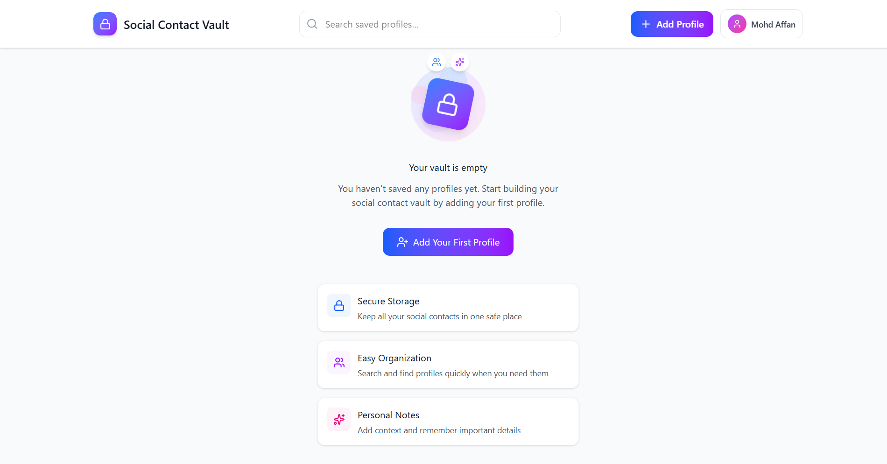

# Profile Vault

Profile Vault is a simple web application that allows users to create and share a single profile page containing links to their social media accounts.
It works like a mini link-in-bio tool where users can store and open all their important social profiles from one place.

## 📸 Screenshots

## 🚀 Features

- Create a personal profile page
- Add social media usernames (Instagram, LinkedIn, etc.)
- Open social profiles directly
- Mobile-friendly interface
- Hosted on Vercel
- Simple and fast UI

## 🛠️ Tech Stack

- React.js
- Tailwind CSS
- Appwrite (Authentication & Backend)
- Vercel (Hosting)

## 📦 Installation

Clone the repository:

git clone https://github.com/Mohd-Affan-Code/Social_Vault_Profile

Go to project directory:

cd profile-vault

Install dependencies:

npm install

Run the development server:

npm run dev

## 🌐 Live Demo

https://social-vault-profile.vercel.app/

## 📁 Project Structure

src/
├── components
├── pages
├── services
└── App.jsx

## 🎯 Future Improvements

- Profile customization
- More social platforms
- Analytics for profile clicks
- QR code for profile sharing

## 🤝 Contributing

Contributions are welcome.
Feel free to fork this repository and submit a pull request.

## 📄 License

This project is open-source and available under the MIT License.
